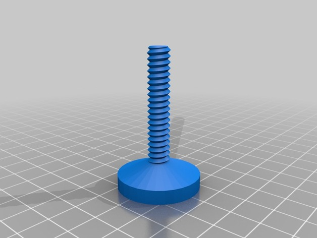
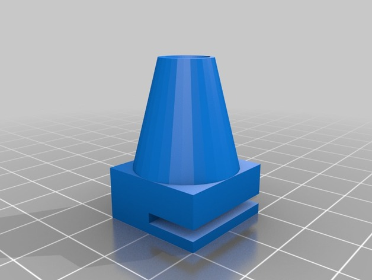

# spacer-model

This is a 3d model for OpenScad, desgined to be a flexible spacer. 

Turn in or out the screw to adjust the distance you need. The base-model is good for distances of 5cm to 6.5cm. The screw can easily be modified in the source to vary the distance.




## Use and modify

You will need [OpenSCAD](http://www.openscad.org "OpenSCAD") to use and modify this model.

In the file spacer-model.scad change the variable part to choose which part to see or modify.

```
// "base" or "screw"
part="screw";

```

To adjust the screw length change this one

```
// Screw length in mm
screw_length=50;
```

## Get stl

You can get the ready-to-print stl-files here
on [Thingiverse](https://www.thingiverse.com/thing:3385677)